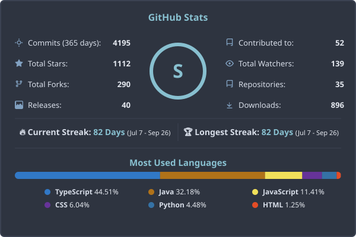

# Hi there, I'm Harshit Soni (aka Felix-au) 👋
*(He/Him)*

I am a **Systems Programmer, AI Engineer, and Full-Stack Developer** passionate about building highly polished, performance-oriented Windows desktop utilities, deep-learning models, and responsive web systems. I specialize in offline-first architectures, local AI deployment, and constraint-based algorithms.

---
## 📊 GitHub Analytics

  

---

## 📬 Connect with Me

- **Email:** [felixaugum@gmail.com](mailto:felixaugum@gmail.com)
- **GitHub:** [github.com/Felix-au](https://github.com/Felix-au)
